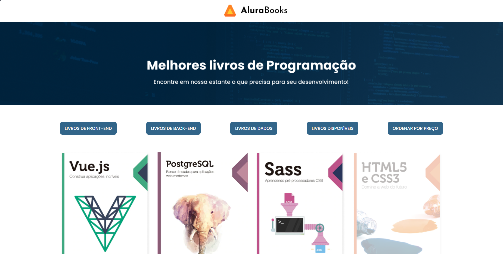

---

# AluraBooks 📚

Bem-vindo(a) ao projeto AluraBooks! Aqui você vai explorar as funcionalidades mais avançadas de **manipulação de arrays em JavaScript**. Nosso objetivo é processar dados de livros de forma moderna e eficiente, utilizando métodos que otimizam seu código e o tornam mais legível. ✨

---

## Veja o AluraBooks em Ação\! 👀

-----

### O que você vai aprender? 🚀

Neste projeto, você vai colocar a mão na massa e praticar o uso dos seguintes métodos essenciais de array:

* **`forEach()`**: Diga adeus aos loops `for` tradicionais! 👋 Com `forEach()`, você vai aprender a percorrer arrays de forma elegante e executar ações para cada elemento sem complicações.
* **`map()`**: Quer transformar todos os elementos de um array e ter um **novo array** com os valores atualizados? `map()` é a solução! 💰 Imagine aplicar um desconto a todos os livros e ver uma nova lista de preços em instantes.
* **`filter()`**: Precisa criar um **novo array** contendo apenas os elementos que satisfazem uma condição específica? 🎯 Com `filter()`, você consegue, por exemplo, exibir somente os livros disponíveis ou filtrar por uma categoria específica.
* **`sort()`**: Organize seus dados do jeito que quiser! 🗄️ Use `sort()` para ordenar os elementos de uma lista, seja por preço, título ou qualquer outra propriedade dos seus livros.
* **`reduce()`**: Chegou a hora de "reduzir" todo o array a um único valor. 🧠 `reduce()` é perfeito para calcular o valor total de todos os livros, encontrar o livro mais caro, ou consolidar qualquer informação do seu array em um único resultado.

---

Com esses métodos, você terá em suas mãos ferramentas poderosas para manipular e analisar grandes volumes de dados de forma concisa e eficiente. Prepare-se para otimizar seu código e torná-lo mais performático! 💻

---
